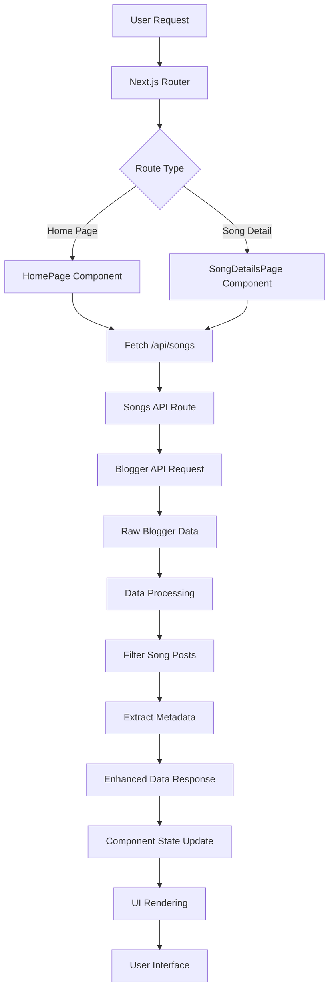

# Tamil Song Lyrics Web Application - Comprehensive Documentation

## 📋 Table of Contents
1. [Project Overview](#project-overview)
2. [Design Concepts](#design-concepts)
3. [Architecture & Technology Stack](#architecture--technology-stack)
4. [Component Structure](#component-structure)
5. [Data Flow](#data-flow)
6. [API Integration](#api-integration)
7. [SEO & Performance Strategy](#seo--performance-strategy)
8. [Monetization Strategy](#monetization-strategy)
9. [Deployment & Configuration](#deployment--configuration)
10. [File Structure](#file-structure)

---

## 🎯 Project Overview

### **Purpose**
A modern, SEO-optimized web application for displaying Tamil song lyrics sourced from a Blogger API. The application serves as a content aggregation platform that fetches, processes, and displays Tamil song lyrics with rich metadata in an elegant, user-friendly interface.

### **Key Objectives**
- **Content Aggregation**: Automatically fetch latest Tamil song lyrics from Blogger
- **SEO Optimization**: High search engine visibility for Tamil music content
- **User Experience**: Clean, responsive design for high user engagement
- **Monetization**: Strategic ad placement for revenue generation
- **Performance**: Fast loading times and optimized content delivery

---

## 🎨 Design Concepts

### **Design Philosophy**
- **Minimalist Approach**: Clean, distraction-free reading experience
- **Content-First**: Lyrics and metadata are the primary focus
- **Mobile-First**: Responsive design optimized for mobile users
- **Accessibility**: Clear typography and intuitive navigation

### **Visual Design System**

#### **Color Palette**
```css
Primary: Blue (#2563eb, #1d4ed8)
Secondary: Purple (#8b5cf6, #7c3aed)
Neutral: Gray (#f9fafb, #6b7280, #374151)
Accent: Green (#059669) for WhatsApp sharing
```

#### **Typography**
- **Headers**: Sans-serif (system fonts) for clarity
- **Body Text**: Sans-serif for readability
- **Lyrics**: Serif fonts for better reading experience
- **Responsive Scaling**: Mobile-optimized font sizes

#### **Layout Principles**
- **Grid-Based**: CSS Grid and Flexbox for responsive layouts
- **Whitespace**: Generous spacing for readability
- **Card Design**: Content organized in visually distinct cards
- **Sticky Navigation**: Consistent user orientation

### **User Experience (UX) Design**

#### **User Journey**
1. **Landing**: Home page with latest songs grid
2. **Discovery**: Browse songs with rich metadata preview
3. **Consumption**: Click to detailed lyrics page
4. **Engagement**: Social sharing and navigation
5. **Retention**: Subscription options and related content

#### **Interaction Design**
- **Hover Effects**: Subtle animations on interactive elements
- **Loading States**: Clear feedback during API calls
- **Error Handling**: User-friendly error messages
- **Progressive Enhancement**: Works without JavaScript

---

## 🏗️ Architecture & Technology Stack

### **Frontend Framework**
- **Next.js 14.2.31**: React-based framework with App Router
- **TypeScript**: Type safety and developer experience
- **Tailwind CSS**: Utility-first CSS framework

### **Backend Integration**
- **Next.js API Routes**: Server-side API endpoints
- **Blogger API**: External content source
- **CORS Handling**: Cross-origin request management

### **Build & Development**
- **npm**: Package management
- **ESLint**: Code linting and quality
- **PostCSS**: CSS processing
- **Vercel**: Deployment platform (configured)

### **Performance Optimization**
- **Server-Side Rendering (SSR)**: SEO and performance
- **Static Generation**: Pre-built pages where possible
- **Image Optimization**: Next.js automatic image optimization
- **Code Splitting**: Automatic route-based splitting

---

## 🧩 Component Structure

### **Page Components**

#### **1. Home Page (`app/page.tsx`)**
```typescript
HomePage
├── Hero Section (removed for content focus)
├── Main Content Grid
│   ├── Song Cards (responsive grid)
│   │   ├── Thumbnail/Placeholder
│   │   ├── Metadata (date, category)
│   │   ├── Title & Description
│   │   ├── Movie/Singer/Lyricist Info
│   │   └── Read Lyrics Link
│   └── Loading/Error States
├── Sidebar
│   ├── Notification Subscription
│   ├── Advertisement Placeholder
│   └── Popular Songs List
└── Bottom Advertisement
```

#### **2. Song Details Page (`app/song/[slug]/page.tsx`)**
```typescript
SongDetailsPage
├── Header Navigation
│   └── Breadcrumb (Home / Song Lyrics)
├── Main Content
│   ├── Song Header
│   │   ├── Thumbnail (if available)
│   │   ├── Title & Metadata
│   │   └── Movie/Singer/Lyricist Details
│   ├── Lyrics Content (HTML rendered)
│   └── Social Sharing Section
├── Sidebar
│   ├── Advertisement
│   └── Quick Navigation
└── Bottom Advertisement
```

### **API Components**

#### **1. Songs API (`app/api/songs/route.ts`)**
- Fetches all posts from Blogger API
- Filters posts with "Song:" category
- Enhances data with extracted metadata
- Implements CORS headers
- Error handling and logging

#### **2. Individual Song API** (Legacy - now using songs API)
- Previously used for individual song fetching
- Replaced by client-side filtering from songs API

### **Configuration Components**

#### **1. Layout (`app/layout.tsx`)**
- Root HTML structure
- Global metadata and SEO tags
- Font loading (Inter)
- Viewport configuration

#### **2. Next.js Config (`next.config.js`)**
- Image domain allowlist
- URL rewrites for .html extensions
- CORS headers configuration
- Proxy settings for Blogger API

---

## 🔄 Data Flow

### **Data Flow Architecture**



### **Detailed Data Flow**

#### **1. Home Page Data Flow**
```
1. User visits home page
2. HomePage component mounts
3. useEffect triggers API call to /api/songs
4. API fetches from Blogger with enhanced parameters
5. Raw data processed and filtered for songs
6. Metadata extracted (movie, singer, lyricist)
7. Processed data returned to component
8. Component state updated with songs array
9. UI renders song cards with enhanced metadata
```

#### **2. Song Details Data Flow**
```
1. User clicks song link with .html extension
2. Next.js rewrites URL (removes .html)
3. SongDetailsPage component mounts with slug param
4. Slug cleaned and processed
5. API call to /api/songs to get all songs
6. Client-side filtering to find matching song
7. Song content extracted and processed
8. HTML lyrics rendered with dangerouslySetInnerHTML
9. Metadata displayed in structured format
```

### **State Management**

#### **Component-Level State**
- **useState**: Local component state for data, loading, errors
- **useEffect**: Side effects for API calls and lifecycle management
- **No Global State**: Simple application doesn't require Redux/Context

#### **Data Caching**
- **Browser Caching**: API responses cached by browser
- **Next.js Caching**: Automatic caching of API routes
- **no-cache Headers**: Ensure fresh data when needed

---

## 🌐 API Integration

### **Blogger API Integration**

#### **Primary Endpoint**
```
URL: https://tsonglyricsapp.blogspot.com/feeds/posts/default?alt=json&max-results=50
Method: GET
Format: JSON
```

#### **Data Structure**
```typescript
interface BloggerResponse {
  feed: {
    title: { $t: string }
    entry: BloggerPost[]
  }
}

interface BloggerPost {
  id: { $t: string }
  title: { $t: string }
  content: { $t: string }
  published: { $t: string }
  category: Array<{ term: string }>
  media$thumbnail?: { url: string }
  // Enhanced by our API
  songTitle?: string
  movieName?: string
  singerName?: string
  lyricistName?: string
}
```

#### **Data Processing Pipeline**
1. **Fetch**: Raw Blogger API data
2. **Filter**: Posts with "Song:" category only
3. **Extract**: Metadata from category terms
4. **Enhance**: Add computed fields
5. **Format**: Clean and structure data
6. **Return**: Processed data to components

#### **Category Processing**
```typescript
Categories Format:
- Song:Monica - Coolie -> songTitle: "Monica - Coolie"
- Movie:Coolie - 2024 -> movieName: "Coolie - 2024"
- Singer:Sublahshini -> singerName: "Sublahshini"
- Lyrics:Vishnu Edavan -> lyricistName: "Vishnu Edavan"
```

---

## 🔍 SEO & Performance Strategy

### **SEO Optimization**

#### **URL Structure**
- **Home**: `/` - Clean root for main keyword targeting
- **Songs**: `/song/[song-name].html` - SEO-friendly with .html extension
- **Descriptive Slugs**: Readable, keyword-rich URLs

#### **Meta Tags & Structured Data**
```typescript
// Root Layout Meta Tags
title: "Tamil Song Lyrics"
description: "Discover latest Tamil songs with lyrics and translations"
viewport: "width=device-width, initial-scale=1"
```

#### **Content Optimization**
- **Rich Metadata**: Movie, singer, lyricist information
- **Semantic HTML**: Proper heading hierarchy
- **Alt Tags**: Descriptive image alternatives
- **Internal Linking**: Cross-linking between songs

### **Performance Strategy**

#### **Core Web Vitals Optimization**
- **Largest Contentful Paint (LCP)**: Optimized image loading
- **First Input Delay (FID)**: Minimal JavaScript on initial load
- **Cumulative Layout Shift (CLS)**: Stable layouts with placeholders

#### **Loading Performance**
- **Critical CSS**: Above-the-fold styles inlined
- **Image Optimization**: Next.js automatic optimization
- **Code Splitting**: Route-based JavaScript splitting
- **Prefetching**: Next.js automatic prefetching

#### **Caching Strategy**
- **API Caching**: Browser and CDN caching
- **Static Assets**: Long-term caching with versioning
- **Service Worker**: Future enhancement for offline support

---

## 💰 Monetization Strategy

### **Google AdSense Integration**

#### **Ad Placement Strategy**
1. **Sidebar Ads**: 300x600 skyscraper ads
2. **Bottom Banner**: 728x90 leaderboard ads
3. **Song Page Ads**: Additional sidebar placement
4. **Strategic Positioning**: High-visibility, non-intrusive

#### **Ad Placeholder Implementation**
```typescript
// Current placeholder structure for easy AdSense integration
<div className="bg-gray-100 border-2 border-dashed border-gray-300">
  <div className="text-gray-500">Advertisement</div>
  <div className="text-gray-400">Google AdSense will be integrated here</div>
</div>
```

#### **Revenue Optimization**
- **High CTR Positioning**: Above-the-fold and sidebar placement
- **Content Integration**: Relevant ad placement near content
- **Mobile Optimization**: Responsive ad units
- **Performance Monitoring**: Analytics for optimization

---

## 🚀 Deployment & Configuration

### **Vercel Deployment**

#### **Build Configuration**
```javascript
// next.config.js optimizations
module.exports = {
  images: {
    domains: ['blogger.googleusercontent.com'],
    formats: ['image/webp', 'image/avif']
  },
  async rewrites() {
    return [
      { source: '/song/:slug.html', destination: '/song/:slug' }
    ]
  }
}
```

#### **Environment Variables**
```
NODE_ENV=production
NEXT_PUBLIC_SITE_URL=https://your-domain.vercel.app
```

### **Performance Monitoring**

#### **Analytics Integration** (Future)
- **Google Analytics**: User behavior tracking
- **Core Web Vitals**: Performance monitoring
- **Error Tracking**: Error monitoring and alerts

---

## 📁 File Structure

```
tsl-spa-webapp/
├── app/                          # Next.js App Router
│   ├── api/                      # API Routes
│   │   └── songs/
│   │       └── route.ts          # Main songs API endpoint
│   ├── song/
│   │   └── [slug]/
│   │       └── page.tsx          # Dynamic song details page
│   ├── globals.css               # Global styles
│   ├── layout.tsx                # Root layout component
│   └── page.tsx                  # Home page component
├── public/                       # Static assets
├── .eslintrc.json               # ESLint configuration
├── next.config.js               # Next.js configuration
├── package.json                 # Dependencies and scripts
├── tailwind.config.ts           # Tailwind CSS configuration
├── tsconfig.json                # TypeScript configuration
└── README.md                    # Project documentation
```

### **Key Files Breakdown**

#### **Core Application Files**
- **`app/page.tsx`**: Main landing page with song listings
- **`app/song/[slug]/page.tsx`**: Dynamic song detail pages
- **`app/layout.tsx`**: Global layout and metadata
- **`app/api/songs/route.ts`**: API for fetching and processing songs

#### **Configuration Files**
- **`next.config.js`**: Next.js optimizations and rewrites
- **`tailwind.config.ts`**: Styling configuration
- **`tsconfig.json`**: TypeScript compiler options

#### **Development Files**
- **`package.json`**: Dependencies and build scripts
- **`.eslintrc.json`**: Code quality rules

---

## 🔮 Future Enhancements

### **Technical Improvements**
- **Search Functionality**: Song search across lyrics and metadata
- **Pagination**: Handle large song catalogs efficiently
- **Caching Layer**: Redis for improved API performance
- **PWA Features**: Offline support and app-like experience

### **User Features**
- **Push Notifications**: Real-time updates for new songs
- **User Favorites**: Personal song collections
- **Social Features**: User comments and ratings
- **Multi-language**: Support for other regional languages

### **SEO & Performance**
- **Sitemap Generation**: Automatic XML sitemaps
- **Schema Markup**: Rich snippets for search results
- **AMP Pages**: Accelerated Mobile Pages for faster loading
- **CDN Integration**: Global content delivery

### **Analytics & Monitoring**
- **Real User Monitoring**: Performance tracking
- **A/B Testing**: Conversion optimization
- **Heat Maps**: User behavior analysis
- **Error Tracking**: Proactive issue resolution

---

## 📊 Success Metrics

### **Performance Metrics**
- **Core Web Vitals**: LCP < 2.5s, FID < 100ms, CLS < 0.1
- **SEO Score**: Lighthouse SEO score > 90
- **Mobile Performance**: Mobile-first responsive design

### **User Engagement**
- **Bounce Rate**: < 40% target
- **Session Duration**: > 2 minutes average
- **Page Views per Session**: > 3 pages
- **Return User Rate**: > 30%

### **Business Metrics**
- **Ad Revenue**: Optimized AdSense performance
- **Organic Traffic**: Search engine visibility
- **Content Freshness**: Automated content updates
- **User Growth**: Subscription and notification engagement

---

This comprehensive documentation provides a complete overview of the Tamil Song Lyrics application architecture, design decisions, and implementation strategy. It serves as both a technical reference and a strategic guide for future development and optimization efforts.
